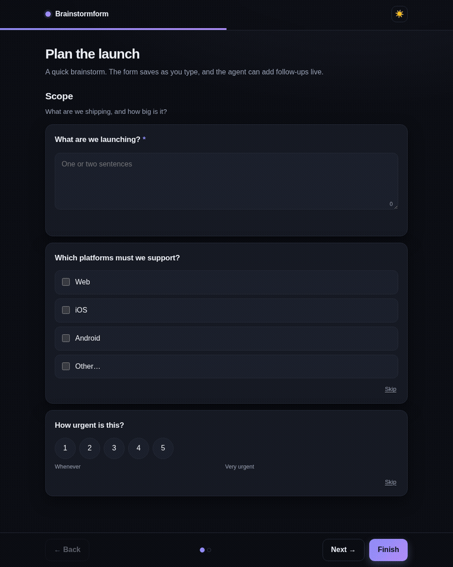

# Brainstormform

[](https://github.com/dutchbase/Brainstormform/actions/workflows/ci.yml)
[](LICENSE)
[](https://nodejs.org)
[](docs/mcp.md)

**Ask a user as many questions as you need, then get out of the way.**

Your coding agent can ask you questions, but usually only a handful at a time,
one round, no files. Brainstormform is a small local tool that lets an agent open
a real form in your browser instead: as many questions as it wants, grouped into
sections, with file uploads, conditional follow-ups, and answers that flow back
as JSON.

It runs on your machine, in a throwaway local server, with no dependencies and
no telemetry.



## Why

Built-in "ask the user" tools are built for a quick decision. They fall over the
moment a real planning session starts:

- The cap is around 4–6 questions, so the agent drops the ones that matter.
- There is nowhere to put a section heading or an explanation.
- You cannot attach a screenshot, a PDF or a reference image.
- It is one round. The agent cannot ask a follow-up based on what you just said.

Brainstormform is what you use when the questions are the point.

## What you get

- **Unlimited questions, in sections.** A progress bar and pagination keep it
  navigable.
- **Every common answer type.** Single and multi choice, text, long text, number,
  rating scale, yes/no, file upload, image cards, a matrix grid and a drag-free
  ranking question.
- **Conditional questions.** Show a question only when an earlier answer calls
  for it.
- **A note on any answer.** When none of the options quite fit, add free-text
  context to any question — even one you skip.
- **Live follow-ups.** The agent reads your answers as you go and can add new
  questions to the same form while you are still filling it in.
- **Answers as JSON.** Typed and clean, straight into the agent's context. Or ask
  for a compact map or Markdown with `--format json|md` to save tokens.
- **Local by default.** Binds to `127.0.0.1`, random port and token, deleted once
  read. Nothing leaves the machine.

## Install

Requires Node 18.17 or newer.

```bash
curl -fsSL https://raw.githubusercontent.com/dutchbase/Brainstormform/main/install.sh | sh
brainstormform setup        # wires up Claude Code, Codex and opencode for you
```

Or without installing anything:

```bash
npx -y github:dutchbase/Brainstormform ask questions.json --open
```

Or from a checkout: `git clone … && cd Brainstormform && npm link`. Full details,
including each agent's manual config, are in [docs/install.md](docs/install.md).

## Quickstart

```bash
brainstormform ask examples/questions.json --open
# {"sessionId":"bf-...","url":"http://127.0.0.1:PORT/s/TOKEN","pid":1234}

# the form is open in your browser; when you press Finish:
brainstormform wait bf-... --timeout 600
```

Write your own questions with `brainstormform guide` as a reference, then point
`ask` at the file. A whole form is just JSON.

## Live sessions

This is the part that makes it useful for brainstorming rather than a one-off
survey. Answers save as you type, so the agent can keep up:

```bash
brainstormform ask questions.json --open
brainstormform progress bf-...            # what has been answered so far
brainstormform add bf-... followups.json  # add questions based on those answers
brainstormform wait bf-... --timeout 600  # resolves only when you press Finish
```

The agent can loop `progress` and `add` as many times as it wants. New questions
drop into the open form without disturbing what you have already answered. Read
more in [docs/live-sessions.md](docs/live-sessions.md).

## Works with your agent

Any agent that can run a shell command can use the CLI. For MCP clients there is
also a stdio server, and `brainstormform setup` detects and configures the ones
it finds:

```bash
brainstormform setup                 # Claude Code, Codex, opencode, Cursor, Gemini CLI
brainstormform setup --target codex  # just one
```

It installs the skill, writes the MCP entry (backing up any config first), and
runs a health check. Manual snippets for every client live in
[docs/mcp.md](docs/mcp.md). The MCP server exposes `ask_questions`,
`read_answers`, `add_questions` and `wait_for_answers`, and pushes a notification
when you answer.

### Tell your agent when to use it

The skill installed by `setup` teaches the agent to choose between Brainstormform
and its built-in question tool: small and static goes to the built-in tool, while
more than a few questions, sections, uploads or live follow-ups come here. It
also advises the agent to use the superpowers **brainstorming** skill as a front
end for creative work — recommended, not required. A copy is bundled in
`skills/brainstorming/` and installed by the same command when you don't already
have one. To install them on their own:

```bash
brainstormform install-skill
```

## Question types

`single` · `multi` · `visual` · `text` · `textarea` · `number` · `scale` ·
`boolean` · `file` · `matrix` · `rank`

Questions support Markdown help text, conditional `showIf`, and suggestions.
The full format is in [docs/schema.md](docs/schema.md).

## Privacy & trust

- **No telemetry and no network calls.** Nothing leaves the machine.
- The server binds `127.0.0.1` only, on a random port, behind a random token.
- Foreign `Host` headers are rejected; upload sizes are capped.
- Sessions live in `$XDG_RUNTIME_DIR` and are deleted the moment the agent reads
  them, unless you ask to keep, export or archive them.
- Run `brainstormform doctor` to see a health check and the exact paths the tool
  can touch: [what it touches on disk](docs/install.md#what-it-touches-on-disk).
- Releases publish checksums (`SHA256SUMS`) and are cut from tagged commits.

## Documentation

- [Install](docs/install.md)
- [Question format](docs/schema.md)
- [CLI reference](docs/cli.md)
- [MCP setup](docs/mcp.md)
- [Live sessions](docs/live-sessions.md)

## Roadmap

Live sessions, conditional questions, visual questions, the review screen and
one-command `setup` have landed. Next up: ranking and matrix questions, a
searchable archive, and a standalone binary so it runs without Node. See
[CHANGELOG.md](CHANGELOG.md).

Out of scope: hosted or multi-user use. Local-first is the security model.

## Contributing

Contributions are welcome. The codebase is small and dependency-free, so it is a
good place to start. See [CONTRIBUTING.md](CONTRIBUTING.md).

## License

[MIT](LICENSE)
